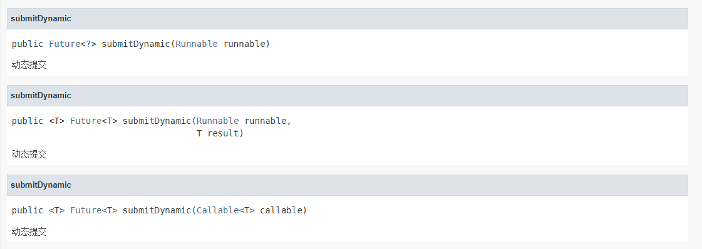

# dynamicpart-tp


## 📖 项目简介

DynamicPart-TP 是一个增强型的动态线程池框架，提供以下核心功能：
- **动态线程池管理**：支持运行时调整线程池参数
- **智能拒绝策略**：默认支持自动扩容机制 + 降级处理 + 告警
- **线程活动监控**：实时跟踪线程状态和执行时间
- **故障转储**：自动持久化线程堆栈信息，未后续分析提供帮助

## 🚀 核心特性

### 1. 追踪线程池 (`TraceableThreadPool`)
继承自 `ThreadPoolExecutor` 的增强实现，内置线程活动追踪和任务执行时间统计

```java
public class TraceableThreadPool  extends ThreadPoolExecutor {
    /**
     * 任务前缀
     */
    private String namePrefix;
    /**
     * 线程执行时间
     */
    private final ConcurrentHashMap<String, Long> taskExecuteTime = new ConcurrentHashMap<>();
    /**
     * 当前活跃线程
     */
    private ConcurrentHashMap<String, Thread> activeThreads = new ConcurrentHashMap<>();
}
```

### 2.智能拒绝策略 (FallBackAlertRejectPolicy)

自动扩容机制：首次拒绝时扩容50%
降级处理：超过扩容阈值后转入备用线程池
自动生成线程转储文件（JSON格式）


### 3.集中式管理 (DynamicPartThreadPoolManager)

```java
public class Test {
    public  void test01(){
        // 获取线程池单例
        DynamicPartThreadPoolManager manager = DynamicPartThreadPoolManager.getInstance();
    }
}
```


## 🛠️ 使用示例

1. 动态线程池不仅支持原jdk中Executors的任务提交方法(使用该方法时不会对任务进行优化包装，不可监控)
2. 同时支持通过**Dynamict()方法即可提交任务到动态线程池中(使用该方法会对任务进行优化包装，具有可检测性)

```java
public class JucTest {

@Test
public void executorServiceTest() throws ExecutionException, InterruptedException {
       ThreadPoolExecutor executorService = new ThreadPoolExecutor(6, 6, 2L, TimeUnit.SECONDS, new LinkedBlockingQueue<>());
       executorService.allowCoreThreadTimeOut(true);
      for (int i = 0; i < 10; i++) {
            executorService.submit(() -> {
                    System.out.println(Thread.currentThread().getName() + "正在执行任务");
                    try {
                       Thread.sleep(3000);
                    } catch (InterruptedException e) {
                        throw new RuntimeException(e);
                    }
            }).get();
      }
  }
}

```

## 📊 监控能力

生成的转储文件示例：
```json
{
  "timestamp" : "2025-06-23_232211",
  "threadCount" : 8,
  "threads" : [ {
    "threadName" : "dynamicPartThreadPool-业务线程池1-5",
    "threadId" : 16,
    "state" : "TIMED_WAITING",
    "priority" : 5,
    "isDaemon" : false,
    "stackTrace" : [ "java.lang.Thread.sleep(Native Method)", "com.pojo123.dynamicpart.DynamicPartTpTest.lambda$main$4(DynamicPartTpTest.java:78)", "com.pojo123.dynamicpart.DynamicPartTpTest$$Lambda$2/1343441044.run(Unknown Source)", "org.pojo123.dynamicparttp.task.TrackableRunnable.run(TrackableRunnable.java:22)", "java.util.concurrent.Executors$RunnableAdapter.call(Executors.java:511)", "java.util.concurrent.FutureTask.run(FutureTask.java:266)", "java.util.concurrent.ThreadPoolExecutor.runWorker(ThreadPoolExecutor.java:1149)", "java.util.concurrent.ThreadPoolExecutor$Worker.run(ThreadPoolExecutor.java:624)", "java.lang.Thread.run(Thread.java:748)" ]
  }, {
    "threadName" : "dynamicPartThreadPool-业务线程池1-1",
    "threadId" : 12,
    "state" : "TIMED_WAITING",
    "priority" : 5,
    "isDaemon" : false,
    "stackTrace" : [ "java.lang.Thread.sleep(Native Method)", "com.pojo123.dynamicpart.DynamicPartTpTest.lambda$main$4(DynamicPartTpTest.java:78)", "com.pojo123.dynamicpart.DynamicPartTpTest$$Lambda$2/1343441044.run(Unknown Source)", "org.pojo123.dynamicparttp.task.TrackableRunnable.run(TrackableRunnable.java:22)", "java.util.concurrent.Executors$RunnableAdapter.call(Executors.java:511)", "java.util.concurrent.FutureTask.run(FutureTask.java:266)", "java.util.concurrent.ThreadPoolExecutor.runWorker(ThreadPoolExecutor.java:1149)", "java.util.concurrent.ThreadPoolExecutor$Worker.run(ThreadPoolExecutor.java:624)", "java.lang.Thread.run(Thread.java:748)" ]
  }, {
    "threadName" : "dynamicPartThreadPool-业务线程池1-8",
    "threadId" : 19,
    "state" : "TIMED_WAITING",
    "priority" : 5,
    "isDaemon" : false,
    "stackTrace" : [ "java.lang.Thread.sleep(Native Method)", "com.pojo123.dynamicpart.DynamicPartTpTest.lambda$main$4(DynamicPartTpTest.java:78)", "com.pojo123.dynamicpart.DynamicPartTpTest$$Lambda$2/1343441044.run(Unknown Source)", "org.pojo123.dynamicparttp.task.TrackableRunnable.run(TrackableRunnable.java:22)", "java.util.concurrent.Executors$RunnableAdapter.call(Executors.java:511)", "java.util.concurrent.FutureTask.run(FutureTask.java:266)", "java.util.concurrent.ThreadPoolExecutor.runWorker(ThreadPoolExecutor.java:1149)", "java.util.concurrent.ThreadPoolExecutor$Worker.run(ThreadPoolExecutor.java:624)", "java.lang.Thread.run(Thread.java:748)" ]
  }, {
    "threadName" : "dynamicPartThreadPool-业务线程池1-4",
    "threadId" : 15,
    "state" : "TIMED_WAITING",
    "priority" : 5,
    "isDaemon" : false,
    "stackTrace" : [ "java.lang.Thread.sleep(Native Method)", "com.pojo123.dynamicpart.DynamicPartTpTest.lambda$main$4(DynamicPartTpTest.java:78)", "com.pojo123.dynamicpart.DynamicPartTpTest$$Lambda$2/1343441044.run(Unknown Source)", "org.pojo123.dynamicparttp.task.TrackableRunnable.run(TrackableRunnable.java:22)", "java.util.concurrent.Executors$RunnableAdapter.call(Executors.java:511)", "java.util.concurrent.FutureTask.run(FutureTask.java:266)", "java.util.concurrent.ThreadPoolExecutor.runWorker(ThreadPoolExecutor.java:1149)", "java.util.concurrent.ThreadPoolExecutor$Worker.run(ThreadPoolExecutor.java:624)", "java.lang.Thread.run(Thread.java:748)" ]
  }, {
    "threadName" : "dynamicPartThreadPool-业务线程池1-3",
    "threadId" : 14,
    "state" : "TIMED_WAITING",
    "priority" : 5,
    "isDaemon" : false,
    "stackTrace" : [ "java.lang.Thread.sleep(Native Method)", "com.pojo123.dynamicpart.DynamicPartTpTest.lambda$main$4(DynamicPartTpTest.java:78)", "com.pojo123.dynamicpart.DynamicPartTpTest$$Lambda$2/1343441044.run(Unknown Source)", "org.pojo123.dynamicparttp.task.TrackableRunnable.run(TrackableRunnable.java:22)", "java.util.concurrent.Executors$RunnableAdapter.call(Executors.java:511)", "java.util.concurrent.FutureTask.run(FutureTask.java:266)", "java.util.concurrent.ThreadPoolExecutor.runWorker(ThreadPoolExecutor.java:1149)", "java.util.concurrent.ThreadPoolExecutor$Worker.run(ThreadPoolExecutor.java:624)", "java.lang.Thread.run(Thread.java:748)" ]
  }, {
    "threadName" : "dynamicPartThreadPool-业务线程池1-2",
    "threadId" : 13,
    "state" : "TIMED_WAITING",
    "priority" : 5,
    "isDaemon" : false,
    "stackTrace" : [ "java.lang.Thread.sleep(Native Method)", "com.pojo123.dynamicpart.DynamicPartTpTest.lambda$main$4(DynamicPartTpTest.java:78)", "com.pojo123.dynamicpart.DynamicPartTpTest$$Lambda$2/1343441044.run(Unknown Source)", "org.pojo123.dynamicparttp.task.TrackableRunnable.run(TrackableRunnable.java:22)", "java.util.concurrent.Executors$RunnableAdapter.call(Executors.java:511)", "java.util.concurrent.FutureTask.run(FutureTask.java:266)", "java.util.concurrent.ThreadPoolExecutor.runWorker(ThreadPoolExecutor.java:1149)", "java.util.concurrent.ThreadPoolExecutor$Worker.run(ThreadPoolExecutor.java:624)", "java.lang.Thread.run(Thread.java:748)" ]
  }, {
    "threadName" : "dynamicPartThreadPool-业务线程池1-6",
    "threadId" : 17,
    "state" : "TIMED_WAITING",
    "priority" : 5,
    "isDaemon" : false,
    "stackTrace" : [ "java.lang.Thread.sleep(Native Method)", "com.pojo123.dynamicpart.DynamicPartTpTest.lambda$main$4(DynamicPartTpTest.java:78)", "com.pojo123.dynamicpart.DynamicPartTpTest$$Lambda$2/1343441044.run(Unknown Source)", "org.pojo123.dynamicparttp.task.TrackableRunnable.run(TrackableRunnable.java:22)", "java.util.concurrent.Executors$RunnableAdapter.call(Executors.java:511)", "java.util.concurrent.FutureTask.run(FutureTask.java:266)", "java.util.concurrent.ThreadPoolExecutor.runWorker(ThreadPoolExecutor.java:1149)", "java.util.concurrent.ThreadPoolExecutor$Worker.run(ThreadPoolExecutor.java:624)", "java.lang.Thread.run(Thread.java:748)" ]
  }, {
    "threadName" : "dynamicPartThreadPool-业务线程池1-7",
    "threadId" : 18,
    "state" : "TIMED_WAITING",
    "priority" : 5,
    "isDaemon" : false,
    "stackTrace" : [ "java.lang.Thread.sleep(Native Method)", "com.pojo123.dynamicpart.DynamicPartTpTest.lambda$main$4(DynamicPartTpTest.java:78)", "com.pojo123.dynamicpart.DynamicPartTpTest$$Lambda$2/1343441044.run(Unknown Source)", "org.pojo123.dynamicparttp.task.TrackableRunnable.run(TrackableRunnable.java:22)", "java.util.concurrent.Executors$RunnableAdapter.call(Executors.java:511)", "java.util.concurrent.FutureTask.run(FutureTask.java:266)", "java.util.concurrent.ThreadPoolExecutor.runWorker(ThreadPoolExecutor.java:1149)", "java.util.concurrent.ThreadPoolExecutor$Worker.run(ThreadPoolExecutor.java:624)", "java.lang.Thread.run(Thread.java:748)" ]
  } ],
  "executeTime" : {
    "dynamicPartThreadPool-业务线程池1-8" : "13ms",
    "dynamicPartThreadPool-业务线程池1-7" : "13ms",
    "dynamicPartThreadPool-业务线程池1-6" : "13ms",
    "dynamicPartThreadPool-业务线程池1-5" : "13ms",
    "dynamicPartThreadPool-业务线程池1-4" : "13ms",
    "dynamicPartThreadPool-业务线程池1-3" : "13ms",
    "dynamicPartThreadPool-业务线程池1-2" : "14ms",
    "dynamicPartThreadPool-业务线程池1-1" : "14ms"
  }
}
```

## 🔧 集成方式

Maven 依赖：
```xml
<dependency>
    <groupId>io.github.dynamicpart-tp</groupId>
    <artifactId>dynamicpart-tp-core</artifactId>
    <version>1.0.1</version>
</dependency>
```


## 📝 注意事项

默认线程池数量限制为200个（可通过修改DEFAULT_RATED_SIZE调整）

转储文件生成在项目根目录下

建议生产环境监控线程池状态

备用线程池使用AbortPolicy，请注意任务丢失风险

动态扩容功能慎用于稳定性要求高的场景
